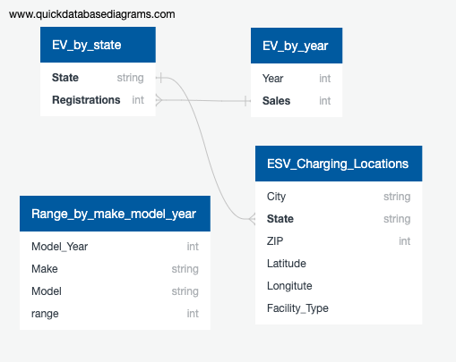

# Electric Vehicle Analysis

## Overview of Project
We are engaging in research on behalf of the state of Florida to determine how many electic vehicle charging stations will be needed by the year 2025. We will use information about the number of EVs registered in each county for years 2018, 2019 and 2020 and regression analysis to figure out our predictions for 2025 and provide these to the state on a county by county basis. We will then be able to advise if the amount of stations is sufficent, needs to be improved, or if stations provided by local and/or state goverment can be reduced for a cost savings.

## Plan
*Use pandas to filter data to provide number of stations per county in FL, as well as number of EVs registered in the state in 2018, 2019, 2020

*Machine learning - use regression to determine the growth factor of EV ownership in the state by county

*Tableau dashboard - will provide information to state on areas most in need of stations as well as possible surplus stations to be investigated

## Resources/Data
*Alternative Fuels Data Center: Maps and Data - Electric Vehicle Registrations by State (energy.gov)

*Alternative Fuels Data Center: Maps and Data - Average Range and Efficiency of U.S. Electric Vehicles (energy.gov)

*https://afdc.energy.gov/data/10567     (US Plug in Electric Vehicle Sales By Model)

## Topic Choice
Coming to an agreement on a topic was not an easy task.  However, once we were able to locate some recent data on electronic vehicles, the ideas started flowing.  Maybe it's the high gas prices, or the fact that many car companies are promising to refocus and produce more electric vehicles.  Ultimately, we found this to be an interesting topic with a wealth of data to explore.

## Preliminary data 
### Week 1
  
- each memeber contributed to the selection of topic and searching for data
- all members participated and helped each other in multiple roles.
- communication is maintained on slack  
#### technology
- data cleaning and analysis will be done via Jupyter
- database will be hosted on aws
- final graphs will be completed using tableau and google

