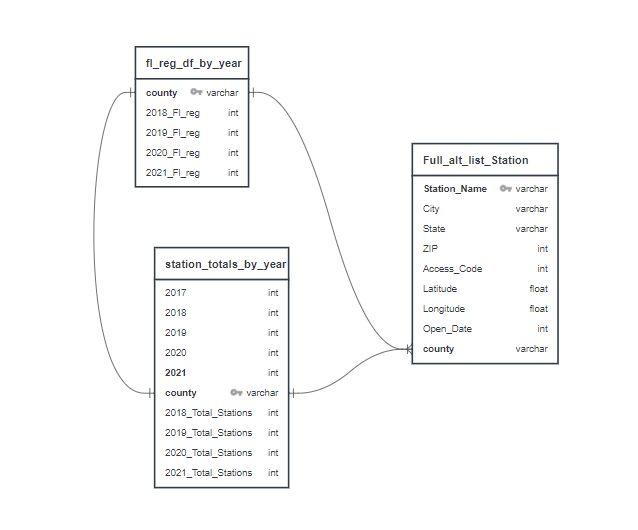
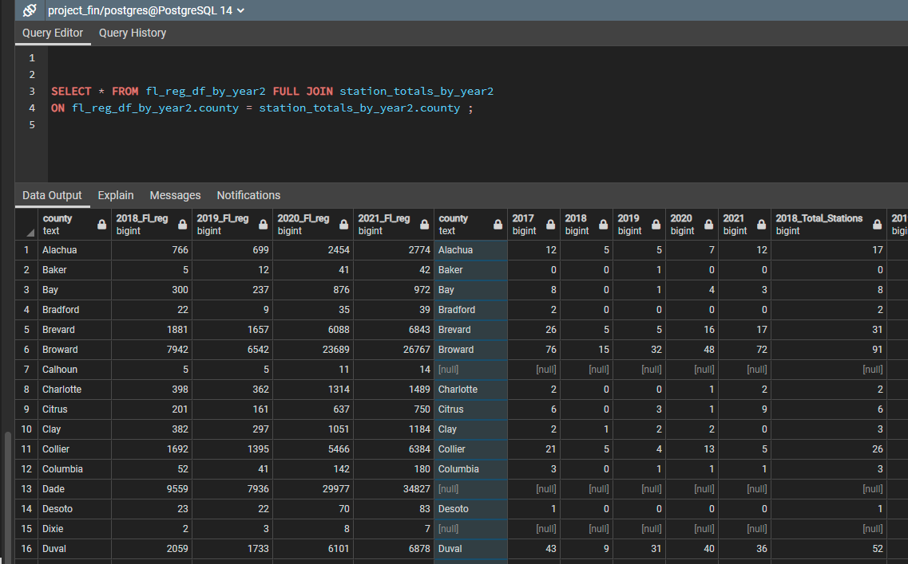

# Electric Vehicle Analysis

## Overview of Project
We are engaging in research on behalf of the state of Florida to determine how many electic vehicle charging stations will be needed by the year 2025. We will use information about the number of EVs registered in each county for years 2018, 2019 and 2020 and regression analysis to figure out our predictions for 2025 and provide these to the state on a county by county basis. We will then be able to advise if the amount of stations is sufficent, needs to be improved, or if stations provided by local and/or state goverment can be reduced for a cost savings.

## Plan
*Use pandas to filter data to provide number of stations per county in FL, as well as number of EVs registered in the state in 2018, 2019, 2020, & 2021

*Machine learning - use regression to determine the growth factor of EV ownership in the state by county

*Tableau dashboard - will provide information to state on areas most in need of stations as well as possible surplus stations to be investigated

## Resources/Data
* alt_fuel_stations.csv
* fl_ev_reg.csv
* zip_county.csv
* Atlas EV Hub

## Topic Choice
Coming to an agreement on a topic was not an easy task.  However, once we were able to locate some recent data on electronic vehicles, the ideas started flowing.  Maybe it's the high gas prices, or the fact that many car companies are promising to refocus and produce more electric vehicles.  Ultimately, we found this to be an interesting topic with a wealth of data to explore.

## Preliminary data 
### Week 3
  
- Each member contributed to the selection of topic and searching for data
- All members participated and helped each other in multiple roles. Although we all assist each other, our project long role assignments are as follows:
  * Julia: Circle
  * Andrew: Square
  * Christianna: Triangle
  * Bethany: X
- Communication is maintained on slack  
#### technology
- Data cleaning and analysis will be done via Jupyter
- Database will be hosted on postgres 
- Final graphs will be completed using tableau and google
- join   
- exported table (join) into [joined.csv](./clean_output/joined.csv)
        
- Gooogle Slides Used for Preliminary Presentation
- Database will be hosted using Postgres

#### Updated Google slides Presentation with new slides

https://docs.google.com/presentation/d/1Ib3dUdZEBJ4KgSuwq_63bpVVxFNANwChGiVY6BfxTS4/edit?usp=sharing

# Week 3 Update

### Machine Learning Model:
- Data was loaded into dataframes in Jupyter, checked for null values, irrelevant columns were dropped, and data was filtered down from charging stations nationwide to just Florida
- We have chosen linear regression as our machine learning model of choice because we want to forecast, based upon historical information from 2018-2020, the amount of EVs that will be owned in 2025. 

# Week 3 Update

- Preliminary tableau dashboard of EV charging stations by county [https://public.tableau.com/app/profile/bethany.hewett/viz/UCFDataAnalyticsandVisualization-ProjectGroup1/Sheet1?publish=yes](https://public.tableau.com/views/UCFDataAnalyticsandVisualization-ProjectGroup1/Sheet6?:language=en-US&publish=yes&:display_count=n&:origin=viz_share_link)
- Updated Google Slides with snip of tableau image

# Week 4 Update
- Built out Tableau dashboard to show charging stations by county by year
- Machine Learning Model determined how many vehicle registrations would exist in the year 2023. The machine learning model we went with was ARIMA (autoregressive integrated moving average). Due to small sample size, train and test data were the same (approved per Eric during class 6/8)
- Calculated by county the average vehicle to charging station ratio which is approximately 67:1
- Findings are that 3,770 charging stations will be needed across the state and as in 2022 there are 2,824, or a defecit of 946 stations across the state
- In 2023 we predict that there will be 252,603 EV registrations with the highest concentration in Dade County which has an anticipated count of 36,370.
